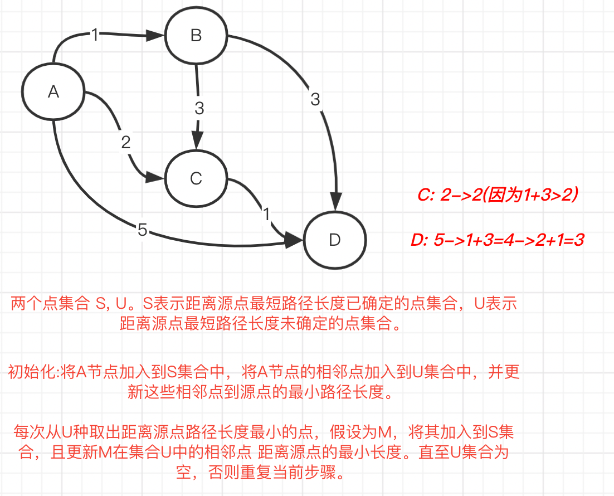

算法标签:

[双指针](#双指针)

[广度优先搜索](#广度优先搜索)

[记忆化搜索](#记忆化搜索)

[动态规划](#动态规划)

[博弈论](#博弈论)

[状态压缩](#状态压缩)

[排序](#排序)

[前缀和](#前缀和)

[最短路](#最短路)

-----------------

# 双指针 
- [四数之和](https://leetcode.cn/problems/4sum/)
> 1.最后两个数的选取可以使用双指针，降低时间复杂度。

> 2.可以进行"剪枝"，跳过不必要的遍历。

> 3.可能出现数值溢出，将int转化为long。


# 广度优先搜索
- [机器人的运动范围](https://leetcode.cn/problems/ji-qi-ren-de-yun-dong-fan-wei-lcof/)
> 1. 走过的路径需要标记，防止重复计数，一般使用一个同规格二维数组辅助解决。

- [01 矩阵](https://leetcode.cn/problems/01-matrix/)
> 题目：给定一个由 0 和 1 组成的矩阵 mat，请输出一个大小相同的矩阵，其中每一个格子是 mat 中对应位置元素到最近的 0 的距离。 两个相邻元素间的距离为 1 。

> 分析:广度优先搜索，首先把所有0元素的坐标放进队列，再设置一个二维访问标记数组visit[][]和输出结果grid[][]。
> 从队列头部移出元素(坐标)，遍历该坐标上下左右4个位置，设置gird[x+dx][y+dy] = grid[x][y], 且将(x+dx, y+dy)坐标也放进队列。


## 总结
- 广度优先搜索的经典场景一般都是迷宫，矩阵问题，在做决策时，往往会有多个选择。
- 广度优先搜索一般使用队列来处理，如果需要识别已经搜索过的位置，还需要使用辅助数组visit，在遍历过程中
已经访问过的路径需要忽略掉。

# 记忆化搜索
- [为运算表达式设计优先级](https://leetcode.cn/problems/different-ways-to-add-parentheses/)
```
题目: 输入：expression = "2*3-4*5"
输出：[-34,-14,-10,-10,10]
解释：
(2*(3-(4*5))) = -34
((2*3)-(4*5)) = -14
((2*(3-4))*5) = -10
(2*((3-4)*5)) = -10
(((2*3)-4)*5) = 10
```

> 1. 自顶向下计算，使用递归

> 2. 递归过程中已经计算过的结果要存储起来，会被重复用到，需要使用一个数组保存计算结果。

> 3. dp[left][right]表示expression[left]到expression[right]组成的子表达式subExpression的所有可能的运算结果。
> 则subExpression的左右边界是数字，内部夹杂着数字和运算符。以其中任意一个运算符作为分割点，则
> 分割点左部分表达式的运算结果集合 _**组合上**_ 右部分表达式的元素结果集合。这个组合的意思就是`_**加，减，乘**_`操作

> 4. 类似的题目还有 [面试题 08.14. 布尔运算](https://leetcode.cn/problems/boolean-evaluation-lcci/)


- [大礼包](https://leetcode.cn/problems/shopping-offers/)
> 题目: 在 LeetCode 商店中， 有 n 件在售的物品。每件物品都有对应的价格。然而，也有一些大礼包，每个大礼包以优惠的价格捆绑销售一组物品。
<br><br>给你一个整数数组 price 表示物品价格，其中 price[i] 是第 i 件物品的价格。另有一个整数数组 needs 表示购物清单，其中 needs[i] 是需要购买第 i 件物品的数量。
<br><br>还有一个数组 special 表示大礼包，special[i] 的长度为 n + 1 ，其中 special[i][j] 表示第 i 个大礼包中内含第 j 件物品的数量，且 special[i][n] （也就是数组中的最后一个整数）为第 i 个大礼包的价格。
<br><br>返回 确切 满足购物清单所需花费的最低价格，你可以充分利用大礼包的优惠活动。你不能购买超出购物清单指定数量的物品，即使那样会降低整体价格。任意大礼包可无限次购买。

> 示例: 
<br>输入：price = [2,3,4], special = [[1,1,0,4],[2,2,1,9]], needs = [1,2,1]
<br>输出：11
<br>解释：A ，B ，C 的价格分别为 ¥2 ，¥3 ，¥4 。
可以用 ¥4 购买 1A 和 1B ，也可以用 ¥9 购买 2A ，2B 和 1C 。
需要买 1A ，2B 和 1C ，所以付 ¥4 买 1A 和 1B（大礼包 1），以及 ¥3 购买 1B ， ¥4 购买 1C 。
不可以购买超出待购清单的物品，尽管购买大礼包 2 更加便宜。


> 分析: 每次我们可能有多个选择可以做，比如不选大礼包原价购买, 选择大礼包1，大礼包2，..., 总有一种或者多种选择手段可使得最后花费的钱最少。
<br><br> min{
<br>方案不选择大礼包购买的价格, 
<br>方案选择大礼包1的价格+购买剩余物品的最小价格，
<br>方案选择大礼包2的价格+购买剩余物品的最小价格, 
<br>
....}
<br><br>
同时注意到**购买剩余物品的最小价格**是一个同类问题，问题规模更小，
所以可以尝试**递归**。
<br><br>
为了加速，我们还需要使用***记忆化搜索***，key是需要购买的剩余物品id和对应的购买数量。
在递归的过程中，可能会重复计算到。比如第一次递归选择是 使用大礼包1->使用大礼包2->使用大礼包1；
后续有一次 递归选择为 使用大礼包2->使用大礼包1->**使用大礼包1**， 后续选择的第三步
使用大礼包1 _**可以不用计算，直接从缓存中取得**_


```java
public int shoppingOffers(List<Integer> price, List<List<Integer>> special, List<Integer> needs) {
        // 有些大礼包是无效的，把有效的大礼包找出来。大礼包中无商品，或者大礼包的价格比内部的商品单买更贵，就是无效的大礼包
        List<List<Integer>> validSpecial = new ArrayList<>();

        for (List<Integer> curSpecial : special) {
            int total = 0;
            int totalPrice = 0;
            int size = curSpecial.size();
            for (int i = 0; i < size - 1; i++) {
                total += curSpecial.get(i);
                totalPrice += curSpecial.get(i) * price.get(i);
            }
            if (total > 0 && curSpecial.get(size - 1) < totalPrice) {
                validSpecial.add(curSpecial);
            }
        }

        //递归 + 记忆化搜索
        return dfs(price, validSpecial, needs);
    }

    Map<List<Integer>, Integer> needsToPrices = new HashMap<>();

    private int dfs(List<Integer> prices, List<List<Integer>> specials, List<Integer> needs) {
        if (needsToPrices.get(needs) == null) {
            // 先初始化为不使用大礼包，单独购买每件物品所需要的价格。
            int needPrices = 0;
            for (int i = 0; i < needs.size(); i++) {
                needPrices += needs.get(i) * prices.get(i);
            }

            // 再尝试使用大礼包，假设有3个大礼包，
            // 使用大礼包1所耗费的最低总价格= 大礼包1价格 + 购买剩下物品所需的最低总价格(这里要递归)
            // 使用大礼包2所耗费的最低总价格= 大礼包2价格 + 购买剩下物品所需的最低总价格(这里要递归)
            // 使用大礼包3所耗费的最低总价格= 大礼包3价格 + 购买剩下物品所需的最低总价格(这里要递归)
            // needPrices要取这些决策的最小值
            for (List<Integer> special : specials) {
                int n = special.size() - 1;
                List<Integer> nextNeeds = new ArrayList<>();
                boolean ignoreSpecial = false;
                for (int i = 0; i < n; i++) {
                    if (special.get(i) > needs.get(i)){
                        ignoreSpecial = true;
                        break;
                    }
                    nextNeeds.add(needs.get(i) - special.get(i));
                }
                if (ignoreSpecial){
                    continue;
                }
                int curPrice = special.get(n) + dfs(prices, specials, nextNeeds);
                needPrices = Math.min(needPrices, curPrice);
            }

            needsToPrices.put(needs, needPrices);
        }
        return needsToPrices.get(needs);
}
```

- [划分为k个相等的子集](https://leetcode.cn/problems/partition-to-k-equal-sum-subsets/)

> 题目:给定一个整数数组  nums 和一个正整数 k，找出是否有可能把这个数组分成 k 个非空子集，其总和都相等。

> 示例: 输入： nums = [1,2,2,3,3,4,5], k = 4
输出： True
说明： 有可能将其分成 4 个子集（5），（1,4），（2,3），（2,3）等于总和。

> 分析: 
<br> 1. k个子集，每个子集的和为target = sum/k，数组排序后再分析更方便。
<br> 2. 如何标记是否已划分某个元素？由于最多才16个元素，可以采取**位操作**来标记数组中某个元素是否已经划分。
如101b,表示数组中第1，3个元素(从1算起)已经划分。
<br> 3. 我们尝试找出这样的一个个子集，具体这样操作，从未划分的元素中选取一个元素，
> 如果与当前正在处理的子集元素总和summ相加仍然不超过target，则该元素可划分；否则不可划分。
当划分后，新的子集元素总和为summ+nums[i],如果正好为target，一个元素和为target的子集我们已经找到了，
我们需要找下一个子集了，否则当前子集需要继续找元素进行补充。当最后所有元素都用完，且最后一个集合元素之和
为target时

```java
/**
     * dfs + 记忆化搜索
     *
     * @param nums
     * @param k
     * @return
     */
    public boolean canPartitionKSubsets(int[] nums, int k) {
        if (k == 1) {
            return true;
        }

        int len = nums.length;
        Arrays.sort(nums);
        int sum = 0;
        for (int num : nums) {
            sum += num;
        }
        if (sum % k != 0) {
            return false;
        }
        int target = sum / k;
        if (nums[len - 1] > target) {
            return false;
        }


        return dfs(0, 0, nums, len, target);
    }

    /**
     * 能否根据state所表示的未使用数字集合，任意个元素组合，使其和都为target
     *
     * @param state
     * @param summ 当前已经获取到的累计和，不大于target。要尝试从nums中未选择的一个数中，找一个使其和未target
     * <p>
     * 这里加上缓存 state->bool
     */
    Map<Integer, Boolean> cache = new HashMap<>();

    private boolean dfs(int state, int summ, int[] nums, int n, int target) {
        if (cache.get(state) == null) {
            boolean res = false;
            // 表示原始数组中的所有元素都已经使用完
            if (state == (1 << n) - 1) {
                res = true;
            } else {
                // 遍历原始数组中的每个未使用的元素，都可以尝试累加在summ上，只要累加后和不超过target
                for (int i = 0; i < n; i++) {
                    // 表示第i个数未使用(i从0算起)
                    if ((state & (1 << i)) == 0) {
                        //尝试使用
                        if (summ + nums[i] > target) {
                            // 后续的数字比nums[i]更大，更不可能
                            break;
                        } else {
                            int nextState = state | (1 << i);
//                    注意:这种写法不对，这种写法表示选择任意一个未使用的数，达不到目标，目标就无法达成
//                    实际上应该是 选择一个未使用的数(任意选择)，有一种选择方案，能达到目标，就可以
//                    if (summ + nums[i] == target){
//                        return dfs(nextState, 0, nums, n, target);
//                    }else {
//                        return dfs(nextState, summ + nums[i], nums, n, target);
//                    }
                            // 修改如下:
                            // 寻找下一个子集合，使其和=target
                            if (summ + nums[i] == target && dfs(nextState, 0, nums, n, target)) {
                                res = true;
                            }
                            // 寻找下一个未使用元素，使当前子集元素和 + 下一个未使用元素 = target
                            else if (dfs(nextState, summ + nums[i], nums, n, target)) {
                                res = true;
                            }
                        }
                    }
                }
            }
            cache.put(state, res);
        }
        return cache.get(state);

    }
```

- [自行车炫技赛场](https://leetcode.cn/problems/kplEvH/)
> 分析:三维数组，递归 + 记忆化搜索

# 动态规划
- [变换的迷宫(困难)](https://leetcode.cn/problems/Db3wC1/)
> 1. 多维矩阵(3维及以上)
> 2. 解决该问题涉及到的知识点很多，有动态规划，深度优先搜索，广度优先搜索，状态机等。


# 博弈论

- [Nim 游戏](https://leetcode.cn/problems/nim-game/)
> 题目: 你和你的朋友，两个人一起玩Nim 游戏：
桌子上有一堆石头。
你们轮流进行自己的回合，你作为先手。
每一回合，轮到的人拿掉1 - 3 块石头。
拿掉最后一块石头的人就是获胜者。
假设你们每一步都是最优解。请编写一个函数，来判断你是否可以在给定石头数量为 n 的情况下赢得游戏。如果可以赢，返回 true；否则，返回 false 。

>示例: 
<br>输入：n = 4
<br>输出：false
<br>解释：以下是可能的结果:
<br>1. 移除1颗石头。你的朋友移走了3块石头，包括最后一块。你的朋友赢了。
<br>2. 移除2个石子。你的朋友移走2块石头，包括最后一块。你的朋友赢了。
<br>3.你移走3颗石子。你的朋友移走了最后一块石头。你的朋友赢了。
   在所有结果中，你的朋友是赢家。

>分析: 当前人要赢满足两个条件任一即可
<br> 1. 当前人可以选择移动1，2，3块石头，任意一种选择，移动后，剩下没有石头了则当前人能赢
<br> 2. 当前人可以选择移动1，2，3块石头，任意一种选择，移动后，对方赢不了，当前人也能赢。因为当前人
> 用博弈的思想决策后就会采取这种选择方式。举个例子，剩下5颗石头，自己移动2，3颗石头，对方都能赢；
> 但当自己只移动1颗石头使，对方就赢不了，那么自己就能赢

```java
Map<Integer, Boolean> map = new HashMap<>();
/**
 * 剩余石头数量为n时，当前人能否赢
 * @param n
 * @return
 */
private boolean dfs(int n){
    if (map.get(n) == null){
        boolean result = false;
        // 当前人可以选择拿掉1，2，3个石头
        for (int i = 1; i <=3 ; i++) {
            // 任意一种拿法自己能赢就赢了
            if (n == i){
                result = true;
                break;
            }
            // 存在一种拿法，会使对方输掉，自己也算赢
            if (!dfs(n - i)){
                result = true;
                break;
            }
        }
        map.put(n, result);
    }
    return map.get(n);
}
```
## 总结
- 博弈论主要用于在一个平等的对局中，二人各自利用对方的策略变化自己的策略，以达到取胜的最终目的。

-----------

# 状态压缩

## 总结
- 判断一个数字x二进制下第i位是不是等于1。
> 方法：if(((1<<(i−1))&x)>0)

- 将一个数字x二进制下第i位更改成1
> 方法：x=x|(1<<(i−1))

- 把一个数字二进制下最靠右的第一个1去掉
> 方法：x=x&(x−1)

- 状态压缩本质还是一种暴力求解

---------------

# 排序
- [存在重复元素 III](https://leetcode.cn/problems/contains-duplicate-iii/)

> 题目: 给你一个整数数组 nums 和两个整数k 和 t 。
请你判断是否存在 两个不同下标 i 和 j，使得abs(nums[i] - nums[j]) <= t ，同时又满足 abs(i - j) <= k 。
如果存在则返回 true，不存在返回 false。

> 分析: 
<br><br>1. k决定了滑动窗口的大小，当遍历到nums[i]元素时，如何知道其前的k个元素nums[i-k]到nums[i-1]与nums[i]
的差值绝对值都在t范围内?
<br><br>2. **使用桶**，每个桶的理论元素最大值与理论最小值差值为t，则两个元素的差值绝对值
<=t时，必然两个元素落在同一个桶里，或者在相邻的桶里且差值<=t，否则必然超过t。
<br><br>3. 注意到两个int相减可能会溢出，且计算允许桶内元素差值最大值为t+1时也可能溢出，
代码中要将int转化为long

```java
/**
     * 桶排序，每个桶的容量设置为t+1,连续的数字可以尝试放置进一个桶里面，
     * 比如 t=3,
     * 0,1,2,3 放置到桶编号0里，
     * 4,5,6,7 放置到桶编号1里
     * value = (t+1)*a+b。如果value满足左侧表达式，则value应该放置在编号a桶里
     * 注意，value可能为负数，所以桶编号也可能为负数
     *
     * 遍历到元素nums[i]时，根据计算nums[i]如果应该放置在桶编号m里，
     * 去查询m桶里是否已经存在元素，如果存在，则说明已经存在一个元素满足abs(nums[i] - nums[j]) <= t ,则返回true。
     * 如果不存在，则查m桶相邻的m-1桶和m+1桶是否存在元素满足abs(nums[i] - nums[j]) <= t,如果存在，则返回true。
     *
     * 否则, 将nums[i]放置到m桶里。另外，将nums[i-k]从桶里移除。
     *
     * 另外，要注意到溢出的风险。int val1, val2,
     * val1+1可能溢出。
     * val1-val2也可能溢出。
     * @param nums
     * @param k
     * @param t
     * @return
     */
    public boolean containsNearbyAlmostDuplicate(int[] nums, int k, int t) {
        Map<Long, Integer> bucketToVals = new HashMap<>();
        for (int i = 0; i < nums.length; i++) {
            int val = nums[i];
            // size必须使用long型，因为t+1可能会溢出int
            long size = (long)t + 1;
            long bucketIdx = getIdx(val, size);
            if (bucketToVals.get(bucketIdx) != null){
                return true;
            }
            if (bucketToVals.get(bucketIdx-1) != null && Math.abs((long)bucketToVals.get(bucketIdx-1) - val) <= t){
                return true;
            }
            if (bucketToVals.get(bucketIdx+1) != null && Math.abs((long)bucketToVals.get(bucketIdx+1)-val) <=t ){
                return true;
            }
            bucketToVals.put(bucketIdx, val);
            if (i - k >= 0){
                bucketToVals.remove(getIdx(nums[i-k], size));
            }
        }
        return false;
    }

    public long getIdx(int val, long size){
        if (val>= 0){
            return val /size;
        }
        return ((long)val + 1)/size - 1;
    }
```

- [排序数组(快速，堆，归并)](https://leetcode.cn/problems/sort-an-array/)

> 时间复杂度都为O(nlogn),空间复杂度快速O(logn)，堆排序O(1),归并O(n)。
<br><br> 主要是理解并记忆解题模板。


# 前缀和
- [将数组分成三个子数组的方案数](https://leetcode.cn/problems/ways-to-split-array-into-three-subarrays/)

> 题目: 我们称一个分割整数数组的方案是 好的 ，当它满足：
数组被分成三个 非空 连续子数组，从左至右分别命名为 left ， mid ， right 。
left 中元素和小于等于 mid 中元素和，mid 中元素和小于等于 right 中元素和。
给你一个 非负 整数数组 nums ，请你返回 好的 分割 nums 方案数目。由于答案可能会很大，请你将结果对 109 + 7 取余后返回。

> 分析: 
<br><br>1. 就是给数组切两刀，分成3个片段，每个片段的元素之和 递增(非严格递增),问这两刀有多少种切法?
<br><br>2. 由于总是要计算片段内的元素和，还不如一次计算完，因为要搞出一个前缀和数组int[] sum。
> sum[i]表示原数组中从nums[0]到nums[i]的元素的和。
<br><br>3. 使用二分查找解决, 假设第一道在i位置砍下去，第二刀在k位置砍下去,sum[k]的最小值为`2*sum[i]`, 
sum[k]的最大值为 `sum[i] + (sum[n-1]-sum[i])/2`。
<br><br>4. 使用三指针解决，在前缀数组上枚举第一刀 i 的位置，对于每个 i 我们寻找第二刀最小的 
left 和最大的 right，分别满足 sum[left] - sum[i] >= sum[i] 
和 sum[n] - sum[right] >= sum[right] - sum[i]，即sum(mid) >= sum(left) 和 sum(right) >= sum(mid)，
这两个条件满足单调性，可以利用三指针求解。

# 最短路
- [网络延迟时间](https://leetcode.cn/problems/network-delay-time/)

> 题目: 有 n 个网络节点，标记为 1 到 n。
给你一个列表 times，表示信号经过 有向 边的传递时间。 times[i] = (ui, vi, wi)，其中 ui 是源节点，vi 是目标节点， wi 是一个信号从源节点传递到目标节点的时间。
现在，从某个节点 K 发出一个信号。需要多久才能使所有节点都收到信号？如果不能使所有节点收到信号，返回 -1 。
<br>int networkDelayTime(int[][] times, int n, int k)

> 分析: 经典求单源点到其他点的最短路径长度题目，可以使用`迪克斯特拉算法`。



```java

```