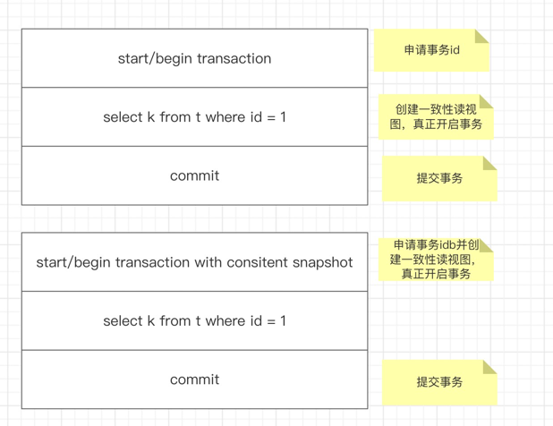

# MVCC是什么？
- 英文名称 Multi-Version Concurrency Control 多版本并发控制。
- 背景知识说明: 一个事务在**真正**开启前，会去向系统申请一个事务id(**trx_id**),这个事务id是全局递增的。而真正开启事务，创建一致性视图
  (**Read View**)是在执行事务语句内的第一条select快照图语句时。  
  
  当然你可以通过`start transaction with consistent snapshot`开启事务
  并同时创建一致性视图，这时事务id和一致性视图是一起出来的。如下图所示

 

- MVCC实现说明: **视图数组，高水位，低水位**，这些都是核心关键词。一个事务在开启的时候(创建一致性视图的时候)，会将当前系统中
正在进行中(活跃)的事务id保存到一个数组中，这个数组就是视图数组。  
  这个数组的最小值就是**低水位**，而开始事务时，系统中已生成的事务id的最大值+1就是**高水位**，_这里要注意到
  系统中已生成的事务id最大值并不一定就是视图数组的最大值，因为后生成的事务id可能先提交。_
  
  