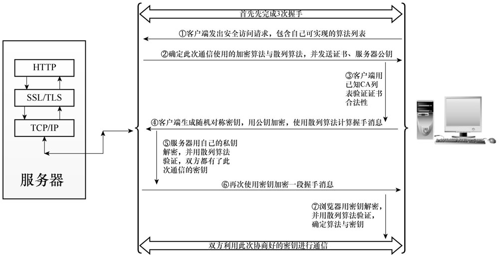

# 加解密算法
- 对称加密，加解密密钥是同一个。常见的有DES、AES、RC4等。
- 非对称加密，密钥成对出现，分为`公钥`与`私钥`，公钥加密、私钥解密(反之亦可)。  
常见的有RSA(支付宝开放平台AlipayClient使用该种)、DSA、DSS。

# 哈希算法
- 不可逆算法，主要用来验证数据的完整性。

# Https工作原理及流程图
 

>总结一下，服务端发送证书和公钥给客户端，客户端确认证书合法并生成一个对称密钥，
> 客户端使用服务器端发送过来的公钥加密对称密钥并发送给服务器端，
> 服务器端使用私钥解密**获得对称密钥**并用对称密钥加密一段报文发送给客户端，
> 客户端使用对称密钥解析**确认服务器端已经得到了对称密钥**。
> 然后他们就可以快乐的使用此次约定的对称密钥进行报文传输了(・ω< )★
