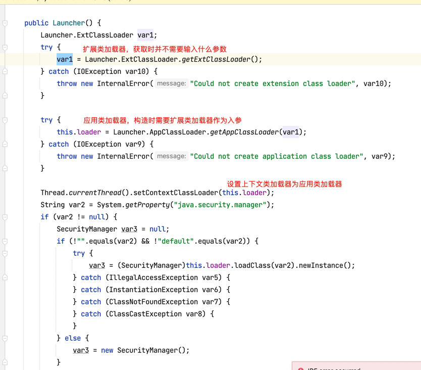

# 类加载器
- 启动类(或根类)加载器(Bootstrap ClassLoader)
- 扩展类加载器(ExtClassLoader)
- 应用类加载器(AppClassLoader)

# 类加载器的初始化
除启动类加载器外，扩展类加载器和应用类加载器的初始化都是在`Launcher`类中完成的，而Launcher类则由根类加载器进行加载。


# 双亲委派模型
- 双亲委派模型：当一个类加载器接收到类加载请求时，会先请求其父类加载器加载，依次递归，当父类加载器无法找到该类时（根据类的全限定名称），子类加载器才会尝试去加载。
- 子类加载器都保留了父类加载器的引用
    ```java
    public abstract class ClassLoader {
    
        private static native void registerNatives();
    
        static {
            registerNatives();
        }
    
        // The parent class loader for delegation
        // Note: VM hardcoded the offset of this field, thus all new fields
        // must be added *after* it.
        private final ClassLoader parent;
        ......
    }
    ```
# ClassLoader#loaderClass源码
ClassLoader类loaderClass部分源码如下
```java

protected Class<?> loadClass(String name, boolean resolve)throws ClassNotFoundException{
    //进行类加载操作时首先要加锁，避免并发加载
    synchronized (getClassLoadingLock(name)) {
        //首先判断指定类是否已经被加载过
        Class<?> c = findLoadedClass(name);
        if (c == null) {
            long t0 = System.nanoTime();
            try {
                if (parent != null) {
                    //如果当前类没有被加载且父类加载器不为null，则请求父类加载器进行加载操作
                    c = parent.loadClass(name, false);
                } else {
                   //如果当前类没有被加载且父类加载器为null，则请求根类加载器进行加载操作
                    c = findBootstrapClassOrNull(name);
                }
            } catch (ClassNotFoundException e) {
            }

            if (c == null) {
                long t1 = System.nanoTime();
               //如果父类加载器加载失败，则由当前类加载器进行加载，
                c = findClass(name);
                //进行一些统计操作
               // ...
            }
        }
        //初始化该类
        if (resolve) {
            resolveClass(c);
        }
        return c;
    }
}

```

# 上下文类加载器
- 子类加载器都保留了父类加载器的引用。但如果父类加载器加载的类需要访问子类加载器加载的类该如何处理？最经典的场景就是JDBC的加载。

# 自定义类加载器
- 自定义类加载器只需要继承java.lang.ClassLoader类，然后重写findClass(String name)方法即可，在方法中指明如何获取类的字节码流。

- 如果要破坏双亲委派规范的话，还需重写loadClass方法(双亲委派的具体逻辑实现)。但不建议这么做。

# 参考
- [Java虚拟机类加载器及双亲委派机制](https://www.cnblogs.com/secbro/p/11759046.html)


